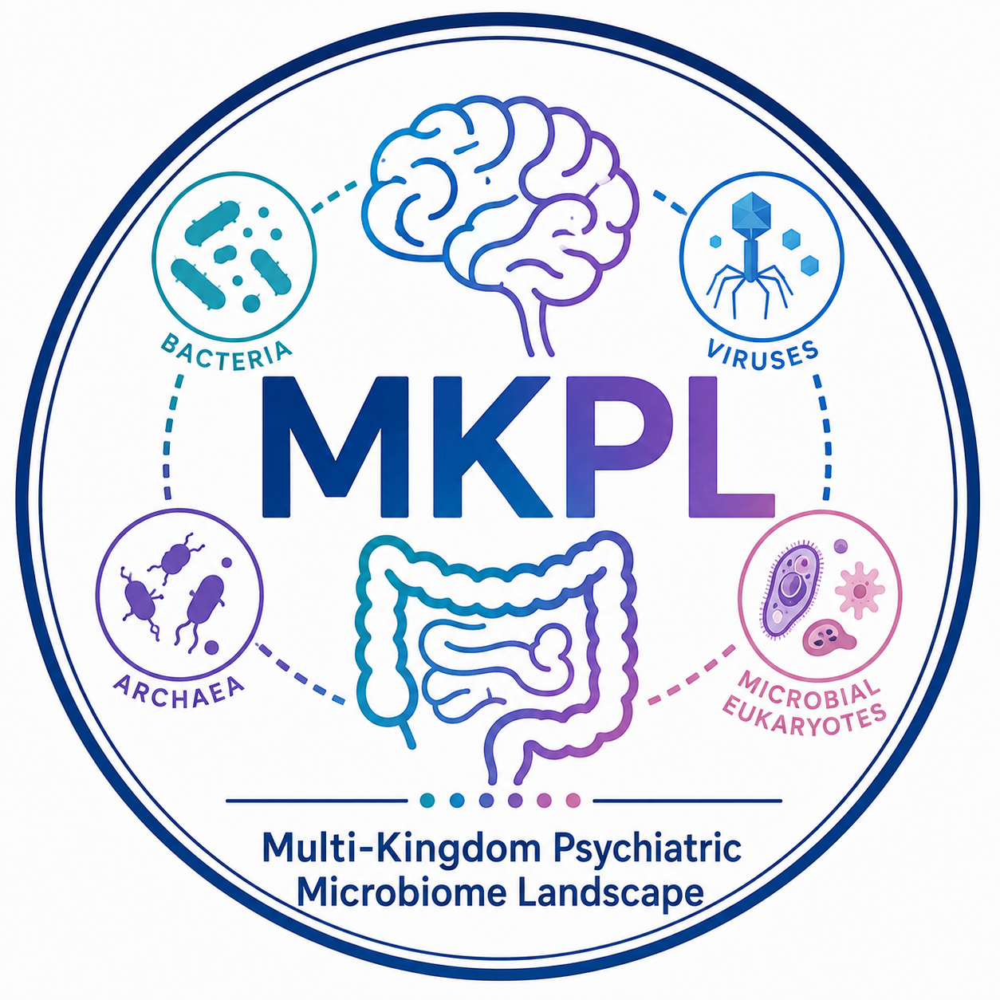

# MKPL: Multi-Kingdom Psychiatric Microbiome Landscape


<p align="center">
  
</p>

<p align="center">
  <b>Multi-Kingdom Psychiatric Microbiome Landscape</b>
</p>

## About MKPL

**MKPL (Multi-Kingdom Psychiatric Microbiome Landscape)** is a research project developed to investigate the gut microbiome across major psychiatric disorders from a multi-kingdom and cross-disorder perspective. The current project focuses on major depressive disorder (MDD), bipolar disorder (BD), and schizophrenia (SZ), together with healthy controls.

Most psychiatric microbiome studies have traditionally been conducted within individual disorders, usually by comparing one patient group with healthy controls. These studies have provided important evidence that the gut microbiome is altered in psychiatric disorders, but they also leave a broader question unresolved: whether different psychiatric disorders are characterized by common microbial perturbations, distinct disease-associated patterns, or both.

Another limitation of the existing literature is the strong emphasis on bacterial communities. The gut ecosystem, however, also contains archaea, viruses, fungi, and other microbial eukaryotes that interact with bacteria and with the host. With the increasing availability of shotgun metagenomic data and improved taxonomic annotation, multi-kingdom profiling is becoming an important direction in microbiome research.

MKPL was developed from these considerations. Rather than treating MDD, BD, and SZ as three independent case-control problems, the project places them within the same analytical framework and examines how multi-kingdom microbial alterations are organized across diagnostic boundaries.

---

## Background and Previous Work

The development of MKPL builds on our previous work on the gut microbiome, brain-gut interactions, and psychiatric heterogeneity. Earlier studies from our group investigated multi-kingdom microbial alterations in individual psychiatric disorders and showed that microbial signals outside the bacterial kingdom may also contain clinically relevant information.

These studies raised a new question. If microbial alterations can be detected independently in MDD, BD, and SZ, how similar are these alterations when the disorders are examined together?

Simply counting significantly altered species is not sufficient to answer this question. The number of significant features can be strongly influenced by sample size, statistical power, prevalence, and effect magnitude. Two disorders may therefore share relatively few statistically significant taxa while still showing similar directions of microbial effects across a much broader set of species.

This consideration became one of the main motivations for MKPL. The project therefore examines psychiatric microbiome similarity at several complementary levels, rather than relying on a single definition of "shared microbiome features".

---

## Current Study

The current MKPL study integrates multi-kingdom metagenomic profiles from healthy controls and individuals with MDD, BD, and SZ. Four major microbial components are considered: **bacteria, archaea, viruses, and microbial eukaryotes**.

We first characterize the overall microbial landscape of each disorder through community composition, alpha diversity, beta diversity, and differential abundance analyses. These analyses provide a conventional description of how each microbial kingdom differs between psychiatric disorders and healthy controls.

The analysis then moves beyond conventional case-control comparisons. Disorder-associated features are compared across MDD, BD, and SZ to distinguish shared and disorder-specific alterations. In parallel, regression coefficients from the full set of microbial species are used to quantify cross-disorder effect-size concordance. This allows us to evaluate whether broader microbial effect patterns remain similar even when individual species do not reach statistical significance in multiple disorders.

We also use an effect-size-based root mean square (RMS) framework to summarize the overall magnitude of microbial perturbation. This analysis provides a complementary view of disease-associated microbial alterations by asking not only which species are significantly altered, but also how strongly the overall microbiome deviates from the healthy reference state across different microbial kingdoms.

Together, these analyses allow the project to examine two related but distinct aspects of psychiatric microbiome organization: **cross-disorder convergence of broader microbial effects and disorder-specific differentiation of significant microbial signatures**.

---

## Functional and Clinical Dimensions

MKPL is not intended to be limited to taxonomic comparisons. A second part of the project investigates how disorder-associated microbial patterns relate to microbial functions and clinical phenotypes.

Microbial features are integrated with functional pathway profiles to examine whether MDD, BD, and SZ share common metabolic frameworks or display different functional organizations. Particular attention is given to pathways related to carbohydrate utilization, fermentation, amino acid metabolism, nucleotide metabolism, vitamin and cofactor metabolism, and other microbial metabolic processes that may be relevant to host physiology.

Clinical analyses further examine associations between microbial patterns and symptom or cognitive dimensions within each disorder. Instead of assuming that the microbiome simply reflects overall disease severity, these analyses explore whether different clinical dimensions are associated with distinct microbial configurations.

This part of the project is intended to provide a bridge between population-level microbial differences and clinically meaningful heterogeneity within psychiatric disorders.

---

## Cross-Disorder Prediction

Another component of MKPL focuses on the generalizability and transferability of disease-associated microbial signatures.

Within-disorder prediction evaluates whether microbial features identified in one disorder can distinguish patients from healthy controls in independent cohorts. Cross-disorder transfer analysis then asks a different question: whether a microbial signature learned from one psychiatric disorder can be transferred to another disorder.

The comparison between within-disorder performance and cross-disorder transfer provides an additional way to evaluate shared and disorder-specific microbial information. Strong within-disorder performance combined with reduced cross-disorder transfer would suggest that microbial signatures contain both general psychiatric signals and diagnostically specific information.

Importantly, prediction is treated here as a tool for evaluating biological generalizability rather than as a stand-alone diagnostic claim.

---

## What We Are Currently Working On

The current stage of the project focuses on completing the harmonized multi-kingdom analysis of MDD, BD, SZ, and healthy controls and organizing all analyses into a reproducible workflow.

We are currently consolidating the major analytical modules, including diversity analysis, differential abundance modeling, shared and disorder-specific feature analysis, cross-disorder effect-size comparison, RMS-based perturbation analysis, functional integration, clinical association analysis, and external prediction.

A major priority at this stage is consistency across analyses. Taxonomic identifiers, metadata variables, covariates, disease labels, statistical thresholds, and visualization settings are being standardized so that results generated from different parts of the pipeline can be directly compared.

The corresponding manuscript is being developed around the concept that major psychiatric disorders may share a broad background of microbiome perturbation while retaining substantial disorder- and microbial kingdom-specific organization.

---

## Next Steps

The next phase of MKPL will focus primarily on reproducibility, external validation, and expansion of the analytical framework.

First, the analysis scripts will be reorganized into independent and reproducible modules so that major figures and statistical results can be regenerated from standardized input files. Parameter settings, statistical models, covariates, random seeds, and software environments will be documented whenever possible.

Second, disease-associated microbial signatures will continue to be evaluated across independent cohorts. Particular attention will be paid to whether cross-disorder similarities observed in the discovery datasets remain stable across populations and whether apparent disorder-specific signals can be reproduced.

Third, we plan to further investigate the biological interpretation of multi-kingdom microbial patterns. Future analyses may integrate additional functional, metabolic, immune, or host-related information where appropriate, with the aim of moving from taxonomic associations toward a more biologically interpretable understanding of psychiatric microbiome alterations.

MKPL is therefore intended to remain an evolving research framework rather than a static collection of differential microbial features.

---

## Repository

This repository will contain the main analysis code, plotting scripts, processed result tables, and documentation used in the MKPL project.

The repository is being organized to follow the major analytical stages of the study, from microbial community characterization to cross-disorder comparisons and predictive analyses. Code will be progressively cleaned and released as the corresponding analyses are finalized.

Raw human metagenomic and clinical data may be subject to ethical, consent, or data-use restrictions and therefore may not be directly distributed through this repository. Where possible, processed or derived data required to reproduce the major analyses will be provided in accordance with the relevant data-sharing policies.

---

## Manuscript

**Shared and Disorder-Specific Multi-Kingdom Gut Microbiome Architecture Across Major Psychiatric Disorders**

The manuscript investigates the organization of multi-kingdom gut microbial alterations across major depressive disorder, bipolar disorder, and schizophrenia, with particular emphasis on cross-disorder similarity, disorder-specific signatures, functional and clinical relevance, and the transferability of microbial signals across diagnostic boundaries.

---

## Citation

If you use the MKPL code or analytical framework, please cite the corresponding manuscript when it becomes available.

```text
Chen S, Zhu B, Lu X, et al.
Shared and Disorder-Specific Multi-Kingdom Gut Microbiome Architecture
Across Major Psychiatric Disorders.
Manuscript in preparation.
